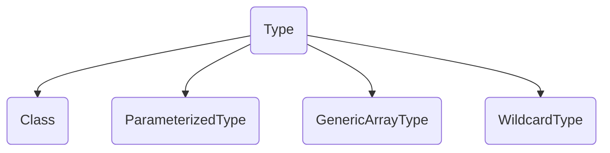
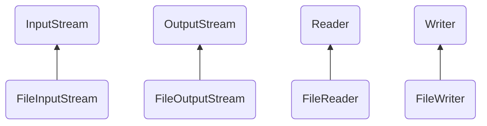
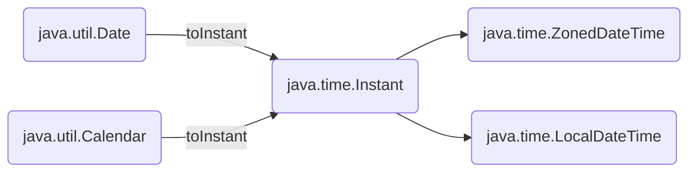

# JAVA基础知识

访问修饰符：

* public : 对所有类可见
* private : 仅在本类中可见
* protected  :  同一个包下的所有类可见，子类可见
* 默认 :  即不添加任何修饰符 ，同一包下的所有类可见


`instanceof`和`Class<?> isInstance()`的区别

public boolean isInstance(Object obj)

`isInstance`  is the dynamic equivalent of the Java `instanceof ` operator.It returns `true` if the specified *Object argument* is non-null and can be cast to the reference type represented by this *Class object* without raising a *ClassCastException* . It returns `false`  otherwise.


## 断言(assertion)

断言assert是在jdk1.4引入的

jvm断言默认是关闭的（在jvm启动参数中添加  -ea: com.yogurt.AssertTest） 来启用指定类的断言

断言是一种调试方式，一般只在开发和测试阶段启用断言

assert 预期其后的语句为true，否则，将抛出AssertionError错误


## java注解

### 自定义注解

* 使用@interface定义注解

* 可定义多个参数和默认值，核心参数推荐使用value

* 必须通过一些元注解来修饰自定义注解，@Target指定注解的应用范围

* 设置@Retention设置注解的作用范围（一般设置为RUNTIME）

  ```java
  @Target({
      ElementType.TYPE,
      ElementType.FIELD,
      ElementType.METHOD
  })
  //定义该注解可以作用域class/interface上，类的成员变量上，类的成员方法上
  @Retention(RetentionPolicy.RUNTIME)
  //定义该注解的作用范围
  public @interface Report{
      int type() default 0;
      String level() default "debug";
      String value() default "";
  }
  ```

  元注解:

  * `@Target`  : 定义Annotation可以被应用于源码的哪些位置

    * 类或接口：ElementType.TYPE

    * 类的字段：ElementType.FIELD

    * 类的方法：ElementType.METHOD

    * 构造方法：ElementType.CONSTRUCTOR

    * 方法参数：ElementType.PARAMETER

      例子：

      ```java
      @Target(ElementType.TYPE)
      //可以传入单一的变量，也可以传入数组
      @Target({
          ElementType.TYPE,
          ElementType.FIELD
      })
      ```

      

  * `@Retention` ：定义Annotation的生命周期

    * 仅编译期：RetentionPolicy.SOURCE  （注解是给编译器看的，编译器编译过后直接丢弃该种注解，如@Override）

    * 仅class文件：RetentionPolicy.CLASS（注解默认的生命周期是CLASS）  (注解会存在于class文件中，但执行时会被VM丢弃)

    * 运行期：RetentionPolicy.RUNTIME （VM在运行期可以保留该注解，可通过反射来读取该注解的信息）

      通常自定义的注解一般的生命周期都是RUNTIME

  * `@Repeatable`：定义该注解是否允许重复（JDK>=1.8）

  * `@Inherited`：定义子类是否可以继承父类定义的Annotationn

    仅针对@Target为ElementType.TYPE，且仅支持class的继承，不支持interface的继承

  * `@Document`：将注解包含在Javadoc中

### 如何处理自定义注解

（只针对RUNTIME类型的注解）

Annotation也是一种类，可以通过反射API来读取Annotation

* Class.**isAnnotationPresent**(annotation.class)  判断某个annotation是否存在
* Field.isAnnotationPresent()
* Method.isAnnotationPresent()
* Constructor.isAnnotationPresent()


获取Annotation

Class | Field | Method .getAnnotation(anno.class)

```java
public class Test{
    @Report(value = "this is String",type = 0）
    private String a;
    
    @Report(value = "this is method",type = 1）
            public void say(){
                Syste.out.println("hello");
            }
            
            public static void main(String[] args){
                Class clazz = Test.class;
                Field[] fs = clazz.getDeclaredFields();
                Method[] ms = clazz.getDeclaredMethods();
                for(Field f:fs){
                    if(f.isAnnotationPresent(Report.class)){
                        Report r = f.getAnnotation(Report.class);
                        System.out.println(r.type()+","+r.value());
                    }
                }
            }
}
```


获取方法参数的annotation比较麻烦，如

```java
public void say(@Report(type = 2) String name, String age){
    //...
}
```

想要获取函数`say()`的参数的注解，如下

```java
Method m = ....;
//这里的m假设是上方的say函数
//因为一个函数的参数是多个，而每个参数又可以有多个注解修饰，所以获取到的是个二维数组
Annotation[][] annos = m.getParameterAnnotations();
Annotation[] annos_1 = annos[0];  //获取第一个参数的注解，上面相当于获取了参数name的注解
for(Annotation anno:annos_1){
    if(anno instanceof Report){
        Report r = (Report) anno;
        System.out.println(".....");
    }
}
```


注意，注解的生命周期一定要为Annotation设置`@Retention(RetentionPolicy.RUNTIME)`，否则，在运行时，无法通过反射对注解进行处理


## 泛型

如ArrayList\<T>

总结：

* 泛型就是编写模板代码来适应任意类型

* 我们不必对类型进行强制类型转换
* 编译器将对类型进行检查
* 泛型的继承关系需要注意
  * `ArrayList<Integer>`可以向上转型为`List<Integer>`(泛型的类型不能变)
  * 然而`ArrayList<Integer>`不能向上转型为`ArrayList<Number>`


给泛型类编写静态方法时，需要将方法声明为泛型方法

```java
public class Pair<T>{
    T first;
    T second;
    //..一些构造方法和set/get方法
    
    //下面这样做是无法通过编译的
    public static Pair<T> create(T t1,T t2){
        return new Pair<>(t1,t2);
    }
    //需要改为
    //其实下面的T和定义中的Pair<T>是不一样的
    public static<T> Pair<T> create(T t1,T t2){
        return new Pair<>(t1,t2);
    }
    //更好的做法是，以示区分
    //表示这个方法接受一个类型参数K，这个K与这个Pair类中的T是不一样的
    public static<K> Pair<K> create(K t1,K t2){
        return new Pair<>(t1,t2);
    }
}
```


类型擦除

java的泛型是通过**类型擦除**（Type Erasure）实现的

在泛型代码编译时，编译器将泛型`<T>`统一视为Object， JVM对泛型一无所知，所有的工作皆是编译器做的

```java
//例子
//下面是编写的代码
public static void main(String[] args){
    Pair<String> pair = new Pair<>("yogurt","bee");
    String first = pair.getFirst();
}

//而下面是编译器实际处理的代码
public static void main(String[] args){
    Pair pair = new Pair("yogurt","bee");
    String first = (String) pair.getFirst();
}

//编译器将<T>视为Object，在需要转型的时候，根据<T>的类型，会执行安全的类型转换
```


### 泛型的局限

由于JAVA的泛型是通过**类型擦除**实现的，所以具有一些局限性：

* `<T>`的类型不能是**基本数据类型**，如`int`

* 由于存在**类型擦除**，所以无法获取带有泛型的Class，也无法判断带泛型的Class

  ```java
  Pair<String> sp = new Pair<>("hello","Java");
  Pair<Integer> ip = new Pair<>(1,2);
  boolean is = sp.getClass() == ip.getClass(); //true
  //sp和ip的Class实际都是  Pair.class
  sp.getClass() == Pair.class  //true
  ```

* 无法实例化泛型`<T>`

  ```java
  public class Pair<T>{
      private T first;
      private T second;
      //...
      public Pair(){
          //下面2句代码，编译器会报错
          first = new T();
          second = new T();
      }
  }
  ```

* 实例化`<T>`必须借助`Class<T>`

  ```java
  public class Pair<T>{
      private T first;
      private T second;
      //...
      public Pair(Class<T> clazz) throws InstantiationException, IllegalAccessException{
          //这里的参数一定要是Class<T> clazz  ,而不能是Class clazz
          //否则，编译器会报错：Incompatible types,required T ,found Object
          first = clazz.newInstance();
          second = clazz.newInstance();
      }
  }
  
  //下面是示例代码
  Pair<String> sPair = new Pair<>(String.class);  //这句能够正确执行
  Pair<String> sPair = new Pair<>(Integer.class);  //这句会导致编译器报错
  ```

由于类型擦除

```java
public class Pair<T>{
    private T first;
    private T second;
    //...
    
    //下面的方法会报错，因为进行类型擦除后，会和Object中的equals方法发生冲突
    public boolean equals(T o){
        return true;
    }
    
    //..另一个例子
    public void test(List<String>){}
    public void test(List<Integer>){}
    //上面两行代码，编译器也会报错，因为进行泛型擦除后，两个方法的签名是一模一样的
}

```


### 泛型的继承

ArrayList是继承自List，我们可以将ArrayList向上转型为List，如

```java
List<String> list = new ArrayList<String>();

```

但是，不能将`ArrayList<Integer>`向上转型为`ArrayList<Number>`，这两者是没有继承关系的，若假设它们可以互相转型

```java
ArrayList<Number> list = new ArrayList<Integer>();
//由于list的泛型是Number，则可以
list.add((Double) 1.35);
//然而这个list对象的实际类型仍然是ArrayList<Integer>
//而它是不允许添加除Integer以外的对象的
```


```java
public class IntPair extends Pair<Integer>{
    
}

public class Test{
    public static void main(String[] args){
        Class<IntPair> clazz = IntPair.class;
    	Type t = clazz.getGenericSuperClass();
        if (t instanceof ParameterizedType){
            ParameterizedType pt = (ParameterizedType) t;
            Type[] types = pt.getActualTypeArguments(); //由于Pair<Integer>只有一个泛型参数Integer，所以这个Type数组只有一个元素
            Type firstType = types[0];
            Class<?> typeClass = (Class<?>) firstType;
            System.out.println(typeClass);  //java.lang.Integer
        }
    }
}
```

下图是Type类的继承关系




### 通配符

#### extends通配符

1. 在传参的时候用

（不确定泛型类的类型参数的时候，可以用`?`，若不确定这个类型参数，但是直到它一定是某一个类的子类时，可以用`<? extends SuperClass>` ）

```java
public static void print(Pair<? extends Number> pair){
    //这样，传入的参数Pair的类型参数可以是Integer，也可以是Double，只要都是Number或Number的子类就可以了
    System.out.println(pair.getFirst());
}
//注意   <? extends Number> 通配符只在使用泛型类时使用，定义泛型类时，一律用<T>或者<K>
//如
public class GenericPair<T,K>{
    //这里的T和K指的是某一具体类型
    private T first;
    private K second;
}
```

注意，如果使用了`<? extends Number> obj` 作为方法的参数时，则这个方法内部

* 允许调用`obj.get`方法获得Number的引用

* 不允许调用`obj.set`方法传入Number的引用，唯一例外`setFirst(null)`

  原因：

  ```java
  public class Test{
      public static void testPair(Pair<? extends Number> pair){
          Number num = pair.getFirst(); //这样是安全的，因为获取到的first无论是什么类型，它一定是Number或Number的子类，这样赋值是安全的（向上转型）
          Float f = new Float(3.5f);
          pair.setFirst(f); //这样是不安全的,编译器会报错，因为不知道Pair的具体类型参数是什么，如这里的例子，main函数中传入的pair的类型是Pair<Double>，而这里试图将一个Float变量设置进去
      }
      public static void main(String[] args){
          Pair<Double> doublePair = new Pair<Double>(4.5);
          testPair(doublePair);  
          
      }
  }
  ```

  

* 其实，若使用`<? extend Number>`作为方法参数时,则这个类型的所有涉及到操作`<T>`的方法都不允许使用

  ```java
  public class Pair<T>{
      private T[];
      public T get(int index){
          //..
      }
      public void add(T t){
          //..
      }
      public void remove(T t){
          ..//
      }
      public void set(int index,T newT){
          T[index] = newT;
      }
  }
  
  public class Test{
      public static void test(Pair<? extends Number> pairNum){
          pairNum.get(1);  //允许执行
          Number num = new Float(1.5f);
          Double d = new Double(2.5f);
          pairNum.add(num);  //编译会报错，不允许执行   <? extends Number> cannot be applied to java.lang.Number
          pairNum.add(d);   //编译会报错，不允许执行    <? extends Number> cannot be applied to java.lang.Number
      }
      public static void main(String[] args){
          Pair<Double> dp = new Pair<>();
          test(dp);
      }
  }
  
  //上述的一些方法，若使用了<? extends Number>，则
  //只允许使用 get方法
  //不允许使用add,remove,set方法，因为它们要不就是参数中包含了具体类型T，要不就是需要对T变量进行操作
  ```

2. 在定义泛型类的时候用

   ```java
   public class Pair<T extends Number>{
       //则这个类型参数被限定是Number或Number的子类
   }
   ```

   

#### super通配符

当一个方法的参数是`<? super Integer> obj` 的时候，在这个方法的内部可以调用`obj.set`方法，只要参数是Integer的超类，即可，然而，无法调用`obj.get`，因为此时获取到的只能肯定是Integer的超类

* 允许使用set方法，传入Integer的引用
* 不允许使用get方法，获取Integer的返回值，除非用Object类型来接收返回值

```java
public static void print(Pair<? super Integer> pair){
    Integer i = 15;
    pair.setFirst(i); //这样是合法的,因为将Integer赋值给其超类，是可以的
    Integer num = pair.getFirst();  
    //上面的语句，编译器会报错，required Number,found <? super Integer>
    //无法确认get方法的返回值是什么类型
    
    //唯一例外，使用Object来接受get函数的返回类型
    Object obj = pair.getFirst();
    
}
```


在定义泛型类时，可以用`<T super Integer>` 来限定某一泛型类的类型参数必须时Integer的超类


比较方法参数为`<? extends Number>` 和`<? super Number>`的区别

* `<? extends Number>` 允许在方法内部调用泛型类的get方法，获取T的引用，不允许调用set等方法，传入Number的引用
* `<? super Number>` 允许在方法内部调用泛型类的set等方法，传入T的引用，不允许调用get方法，获得T的引用，除非用Object对象类接收get方法的返回值

#### 无限定通配符

若一个方法的参数中包含`<?>`通配符，则

* 不允许调用泛型类的set等方法，除非是set(null)
* 调用泛型类的get方法，只能用Object来接收
* 即，既包含了extends通配符的限制，又包含了super通配符的限制

```java
public static void test(Pair<?> pair){
    Object obj = pair.get();
}
```

注意`Pair<?>`和`Pair`是不同的


通常我们引入泛型参数`<T>`来消除`<?>`通配符，如下

```java
public static<T> void test(Pair<T> p){
    Object obj = p.get();
}
```


### 总结

* JAVA的泛型，是采用了**类型擦除**的方法实现的
* **类型擦除**决定了泛型`<T>`
  * 不能是基本数据类型，如int,double
  * 不能获取带有泛型类型的Class，如`Pair<String>.class`
  * 不能判断带有泛型类型的类，如`x instanceof Pair<String>`
  * 不能实例化T，如`new T()`
  * 泛型方法要注意防止重复定义方法，如`public boolean equals(T o)`
* 继承了带泛型类型，子类可以获取到父类的泛型类型`<T>`


### 泛型与反射

部分反射API是泛型

* `Class<T>`是泛型，如

```java
Class<Integer> clazz = Integer.class;
Integer a = clazz.newInstance();
Class<? super Integer> father = clazz.getSuperclass();
```

* `Constructor<T>`也是泛型，如

```java
Class clazz = Person.class;
Constructor<Person> cons = clazz.getConstructor(String.class,int.class);
Person p = cons.newInstance("haha",123);
System.out.println(p);       //haha,123

//以下是Person
public class Person{
    private String name;
    private int age;
    public Person(String name,int age){
        this.name = name;
        this.age = age;
    }
    public String toString(){
        return this.name+","+this.age;
    }
}
```


* 泛型数组

可以声明泛型数组，但不能用new来创建带泛型的数组

```java
Pair<String>[] ps = null;   //ok
Pair<String>[] ps = new Pair<String>[2];   //Complie error
//必须通过强制转型来实现泛型数组
Pair<String>[] ps = (Pair<String>[]) new Pair[2];  //ok
```


使用泛型数组的 时候，要特别小心，因为数组在运行期是没有泛型的

```java
//不安全地使用泛型数组
Pair[] arr = new Pair[2];
Pair<String>[] ps = (Pair<String>[]) arr;
ps[0] = new Pair<String>("a","b");
arr[1] = new Pair<Integer>(1,2);

Pair<String> p1 = ps[1]; 
String s = p1.getFirst();   //编译时没错，运行时抛出异常,ClassCastException

//安全地使用泛型数组
Pair<String>[] ps = (Pair<String>[]) new Pair[2];    //只让Pair<String>[] ps来引用这个数组，不让Pair[] 暴露出来
...
    
    //因为带泛型的数组实际上时编译器进行的类型擦除
```

不能直接创建T[ ]数组。可以通过借助`Class<T>`，或可变参数，来创建T[ ]

* 借助`Class<T>`和`Array.newInstance()`

```java
public class Pair<T>{
    private T first;
    public T[] getTs(){
        return new T[5];  //Type parameter 'T' cannot be instantiated directly
    }
}
//需要借助Class<T>和Array.newInstance

public class Pair<T>{
    private T first;
    public T[] getTs(Class<T> clzz){
        return (T[]) Array.newInstance(clzz,5);  //ok
    }
}
```

* 传入可变参数

  ```java
  public class Pair<T>{
      private T first;
      public static<K> K[] getTs(K ...args){
          return (K[]) args;  
      }
  }
  ```

  

## java集合

### List

`List<E>`是一种有序链表，List的元素可重复，**元素可为null**

```java
List<Integer> list = new ArrayList<Integer>();
list.add(1);
list.add(2);
list.add(null);
list.add(3);
System.out.println(list.size()); //4
```

遍历一个List

* `get(int index)`

* `Iterator<E>`

  ```java
  List<String> list = .....;
  for(Iterator<String> it = list.iterator();it.hasNext();){
      String s = it.next(); 
      //it.next会自动获取下一个元素，并将iterator向后移一位
  }
  ```

* `foreach`

  ```java
  List<String> list = ....;
  for(String s:list){
      System.out.println(s);
  }
  ```

List和Array转换

* List -> Array
  * `Object[] toArray()`

  ```java
  List<String> list = new ArrayList<>();
  list.add("1");
  list.add("2");
  Object[] arr = list.toArray();
  ```
  * `<T> T[] toArray(T[] a)`

  ```java
  List<Integer> list = new ArrayList<>();
  list.add(1);
  list.add(2);
  list.add(3);
  Integer[] arr = list.toArray(new Integer[list.size()]);
  
  //如果传入的T[] a 的长度小于list的长度，则会丢掉这个传入的数组，创造一个新的数组
  Integer[] arrs = list.toArray(new Integer[2]);
  //arrs = [1,2,3]
  //如果传入的T[] a的长度大于list的长度，后面的会为null
  Integer[] arrb = list.toArray(new Integer[5]);
  //arrb = [1,2,3,null,null]
  ```

* Array -> List

  * `<T> List<T> Arrays.asList(T... a)`

    注意这个方法获取的List是**不可变的**

    ```java
    Integer[] arr = {1,2,3};
    List<Integer> list = Arrays.asList(arr);
    //注意返回的是一个List，是Arrays内部实现的一个List类，不是ArrayList，并且这个List是只读的，是不可变的
    list.add(4);  //UnsupportedOperationException
    
    //若想把一个Array变成一个ArrayList,可变的
    Integer[] arr = {2,3,4};
    List<Integer> readOnlyList = Arrays.asList(arr);
    List<Integer> arrList = new ArrayList<>();
    arrList.addAll(list);
    
    //整合一下
    Integer[] arr = {4,5,6};
    List<Integer> arrList = new ArrayList<>(Arrays.asList(arr));
    ```


#### 关于重写equals方法

List中的contains和indexOf方法，用来查找一个元素是否存在于List中，这时就涉及到元素的比较，在集合框架中，元素的比较是使用了equals方法

若要将某个自定义的POJO正确放置在java集合中，如List,Map，需要正确重写equals方法，且要正确重写hashCode方法

equals方法的规范

1. 自反性：x.equals(x) 一定是true
2. 对称性：x.equals(y)一定与y.equals(x)的结果一致
3. 传递性：若x.equals(y)为true，且y.equals(z)为true，那么x.equals(z)也为true
4. 一致性：若x,y引用的对象没有发生改变，那么反复调用x.equals(y)应返回相同的结果


就**对称性**来讲，当参数不属于同一类时，需要好好考虑一下，如：

```java
public class Employee{
    private String name;
    private int salary;
    @Override
    public boolean equals(Object obj){
        //....
    }
}

public class Manager extends Employee{
    private int bonus;
}
```

现有父类Employee对象e和子类Manager对象m，且这两个对象的`name`和`salary`都相同，如果在Employee类的equals方法中，使用instanceof来检测，则返回true，然而如果反过来调用m.equals(e)，也需要返回true(根据对称性原则)。然而，这样就使得Manager类受到了束缚，这个类的equals方法必须能够让Manager类与任何一个Employee对象进行比较，而不考虑Manager类拥有的那部分特殊信息(bonus)。

若子类可以拥有自己的相等概念，则**对称性**原则要求采用`getClass()`来进行检测

若仅仅由父类来决定相等的概念，则可以用`instanceof`进行检测，这样可以在不同的子类对象之间进行比较


下面是实现一个比较完美的equals方法的建议：

1) 显式参数命名为otherObject，稍后需要将它转换成一个叫other的变量（关于**显式参数**和**隐式参数** ->   调用函数x.equals(y), 那么x就是隐式参数，y就是显式参数）

2)先检测this和otherObject是否引用同一个对象，该语句实际只是一个优化，因为计算这一类等式要比一个一个地比较类中的域所付出的开销小很多

```java
if(this == otherObject) return true;
```

3)检测otherObject是否为null

```java
if(otherObject == null) return false;
```

4) 比较this和otherObject是否属于同一类，如果该类的子类有自己独立的相等概念，则用`getClass()`比较，若该类的所有子类的相等概念都相同(相等概念仅在父类中定义)，则用`instanceof`

5)将otherObject转换为相对应的类的变量

```java
//如该equals方法是定义在Employee中，则
Employee other = (Employee) otherObject;
```

6) 现在开始对所需要比较的域进行依次比较


注：如果要在该类的子类中重新定义equals方法，就要在其中包含调用super.equals()

注意重写Object的equals方法时，要注意参数一定得和Object里的equals一致

```java
public class Employee{
    @Override
    public boolean equals(Object obj){
        //...
    }
}
```


- ArrayList   基于数组，随机访问快，添加/删除节点慢
- LinkedList 基于链表，随机访问慢，添加/删除节点快


### Map

是一种Key-Value键值对的映射表

遍历map

* 通过`keySet()`获取到key的集合，再依次取出对应的value

* 通过`entrySet()`获取到entry的集合，再依次去除对应的key和value

  ```java
  Map<String,Integer> map = new HashMap<>();
  map.put("大黄",1);
  map.put("金霞",2);
  map.put("金毛",3);
  for (Map.Entry<String,Integer> entry:map.entrySet()){
  	System.out.println(entry.getKey()+","+entry.getValue());
  }
  //注意HashMap不保证里面的元素有序，遍历时，既不保证是put放入的顺序，也不保证按照key的排序顺序
  
  //SortedMap可以保证遍历时时以key的顺序来遍历的，其实现类是TreeMap
  ```

下面是map的类图


#### equals和hashCode

在Map内部，对key作比较，使用的是equals方法，所以作为key的对象必须正确重写equals方法

**HashMap**是通过计算key的hashCode()来定位该元素的存储位置的

若要正确使用Map,需要保证：

* 作为key的对象，必须要正确重写equals方法和hashCode方法

重写hashCode方法，可以利用Objects.hash()辅助实现

* 若两个对象equals为true，则hashCode一定也为true
* 但反过来不一定成立，尽可能保证不同的对象的hashCode也不同，这样有利于提高效率


### Properties

用于读取配置文件（String），但是xx.properties文件中**只能使用ASCII编码**

可获取文件系统的properties文件，也可以读取classpath下的properties文件

```java
String file = "D:\\conf\\setting.properties";
Properties props = new Properties();
props.load(new FileInputStream(file));
String user = props.getProperty("user");
String pw = props.getProperty("password","root"); //若获取不到，则取默认值root

props.load(JavaTest.class.getResourceAsStream("/db.properties"));
String user = properties.getProperty("user");
String none = properties.getProperty("none","default");

//properties可以多次load,如果后面的properties文件中存在相同的key，则会覆盖前面的load的文件中的key-value
```

Properties是继承自HashTable的，这是有设计缺陷的。

使用Properties时，记得只使用getProperty和setProperty方法，而不要去调用从HashTable继承而来的get和put


### Set

用于存储不重复的元素集合

* `add(E e)`
* `remove(Object o)`
* `contains(Object o)`

Set相当于只存储Key的Map

Set用于去除重复元素

放入Set的元素要正确重写equals和hashCode方法

* HashSet是无序的
* TreeSet是有序的

**可以使用Set来达到去重的效果**

```java
List<String> list1 = Arrays.asList("apple","banana","apple");
Set<String> set = new HashSet<>(list1);
List<String> monoList = new ArrayList<>(set);
```


Set的类图和Map类似


### Queue

`Queue<E>`是一个接口，是一个FIFO的队列

LinkedList实现了`Queue<E>`接口，常用方法如下

* `add(E e) / offer(E e)`添加元素到队尾
* `remove() / poll()` 获取队首元素并删除
* `element()  / peek()` 获取队首元素，但不删除

要避免将null值添加到队列中

当添加/获取元素失败时

|                    | throw Exception | 返回false或null |
| ------------------ | --------------- | --------------- |
| 添加元素到队尾     | `add(E e)`      | `offer(E e)`    |
| 取队首元素并删除   | `E remove()`    | `E poll()`      |
| 取队首元素但不删除 | `E element()`   | `E peek()`      |

#### PriorityQueue

带有优先级的队列

`PriorityQueue<E>`是一个class，其实现了`Queue<E>`接口

获取队首元素，总是先返回优先级更高的元素，放入PriorityQueue的对象，必须要实现Comparable接口

#### Deque

双端队列(Double Ended Queue)，队首和队尾都能添加和删除元素

Deque是一个接口，其实现类有ArrayDeque，LinkedList

|                  | Queue              | Deque                       |
| ---------------- | ------------------ | --------------------------- |
| 添加元素到队尾   | add() / offer()    | addLast() / offerLast()     |
| 取队首元素并删除 | remove() / poll()  | removeFirst() / pollFirst() |
| 取队首元素不删除 | element() / peek() | getFirst() / peekFirst()    |

```java
Deque<String> deq = new LinkedList<>();
deq.offerFirst("big");

//始终用接口来引用对象，能具有更好的语义，更高层次的抽象
```


### Stack

是一种LIFO的数据结构，常用的方法有

* push(E e) : 把元素压栈
* pop(E e) : 把栈顶元素弹出

**可以用Deque来模拟实现Stack**，注意只调用下面的方法

栈的操作  -> Deque中对应的方法

push - > addFirst

pop - > removeFirst

peek - > peekFirst

java是没有stack接口的，这是因为有一个遗留的class，叫做Stack

JVM中方法的嵌套调用就是用栈来实现的

栈的应用：

* 进制转换：将余数压栈，直到商为0为止
* 后缀表达式的计算（注意中缀表达式转后缀表达式）


### Iterator

Java的集合类可以使用for..each循环，这是因为它们实现了Iterable接口，实际java编译器将for..each循环，通过Iterator转换为for循环，进行了遍历。

若要自己编写的类也能使用for..each循环，则需要

- 实现Iterable接口，并正确返回Iterator对象

使用Iterator进行迭代的好处：

* 对任何集合类型都采用同一种访问模式
* 调用者对集合内部的结构一无所知（很好的封装性）
* Iterator是一种抽象的数据访问模型

在编写代码时，可以通过一个内部类来实现Iterator接口。

内部类可以直接访问外部类的字段和方法

### Collections

是JDK提供的工具类

* `addAll(Collection<? super T> c, T... elemenst)`

创建空的集合（注意创建的集合是不可变的，不能向其中添加元素）

* `List<T> emptyList()` 
* `Map<K,V> emptyMap()`
* `Set<T> emptySet()`

* `sort(List<T> list)` 必须传入可变的List

* `shuffle(List<T> list)` 随机重置List的元素，如传入一个有序的list，则会打乱顺序

* `unmodifiableList<List<? extends T> list>`将可变List转换为不可变List

  ```java
  //这个方法得到的并不是一个真正不可变的List
  List<String> list = new ArrayList<>(Arrays.asList("A"));
  List<String> readOnly = Collections.unmodifiableList(list);
  list.add("B");  //调用这一句，也会导致变量readOnly发生改变
  //故，使用unmodifiableList方法，应该马上将原有的list的引用给丢弃掉
  //如下
  
  List<String> readOnly = Collections.unmodifiableList(new ArrayList<>(Arrays.asList("A")));
  ```

  

* `synchronizedList(List<T> list)` 将线程不安全的List转换为线程安全的List（由于jdk1.5之后添加了concurrent包，所以这些方法已不推荐使用了）

=========

注意区分Collection和Collections  [参考链接](https://www.cnblogs.com/cathyqq/p/5279859.html)

[Collection参考链接](https://www.cnblogs.com/taiwan/p/6954135.html)

[参考链接2](http://www.importnew.com/23715.html)

来源于java.util包

Collection的类图：


Java集合的特点：

* 接口和实现分离

  List接口，ArrayList，LinkedList实现类

### HashMap和HashTable


几乎完全一样，它们的区别在于

1.HashTable是synchronized的，即是线程安全的，而HashMap不是

2.HashTable不接受null的键和null的值，而HashMap可以

3.由于HashTable是线程安全，所以HashTable的性能不如HashMap

4.HashTable的iterator迭代器不是fail-fast的，而HashMap的iterator是fail-fast的

5.HashMap不能保证随着时间推移，Map中的元素次序保持不变。若要保持元素顺序不变，应该用LinkedHashMap


**JAVA 5+** 实现了线程安全的HashMap - >   `ConcurrentHashMap`

若要自己实现HashMap的同步，可以调用Collections类的synchronizedMap方法

```java
HashMap<String,String> hashMap = new HashMap<String,String>();
Map map = Collections.synchronizedMap(hashMap);
```

（fail-fast:我们知道HashMap不是线程安全的，因此如果在使用iterator的过程中，有其他线程修改了HashMap的结构(新增或删除一个元素)，那么将抛出`ConcurrentModificationException`，这就是所谓的fail-fast策略，除非是iterator本身的remove方法，其他任何方式的修改，iterator都将抛出`ConcurrentModificationException`）

[fail-fast参考链接](https://www.cnblogs.com/think-in-java/p/5170914.html)


## java IO

### IO基础

#### 总结

* IO流是一种流式的数据输入/输出模型
* 二进制数据以byte为最小单位在InputStream/OutputStream中单向流动
* 字符数据以char为最小单位在Reader/Writer中单向流动
* JDK的java.io包提供了基础的同步IO功能（java.nio包提供了异步IO功能）
* Java的IO流是**接口**和**实现**分离的
  * 字节流接口：InputStream/OutputStream
  * 字符流接口：Reader/Writer


====================================

IO，即Input/Output

Input:将数据从外部读取到内存，如，读文件，从网络读取等

Output:将数据从内存输出到外部，如，写文件，输出到网络


**IO流**（字节流）：一种顺序读写数据的模式（像水管里的水流）

* 单向流动
* 以byte为最小单位（字节流）


**字符流**（若字符不是单字节表示的ASCII码，则可以使用字符流）

* JAVA提供了Reader/Writer
* 传输的最小单位是char
* 字符流输出的byte取决于编码方式


**Reader/Writer** : 本质上，是能自动编码/解码的InputStream / OutputStream

使用Reader/Writer还是InputStream/OutputStream，取决于具体的应用场景。

* 若数据源不是文本，则只能使用InputStream/OutputStream（按字节传输）
* 若数据源是文本，则使用Reader/Writer 更方便一些（自动对字节解码/编码，按字符来传输）


**同步IO & 异步IO**

同步IO：（ java.io.* ）

* 读写IO时，代码必须等待IO操作结束后，才继续执行后续代码
* 代码编写较简单，CPU效率低下

异步IO：（java.nio.*）

* 读写IO时，仅发出IO请求，然后立刻继续执行后续代码
* 代码编写较复杂，CPU效率高


同步IO的类图关系如下



java的IO接口主要包括了上图上方的4个抽象类

其实现类，以读写文件为例，有上图下方的4个实现类。

 

### File对象

#### 总结

* File对象表示一个**文件**或**目录**
* 创建File对象本身不涉及IO操作
* 获取路径/绝对路径/规范路径      `getPath()` / `getAbsolutePath()` / `getCanonicalPath()`
* 可以获取目录下的文件和子目录，可以创建或删除文件或目录


`java.io.File` 表示文件系统的一个**文件**或**目录**

```java
/*创建一个File对象*/
/*@paramete:pathName 注意不同操作系统下路径格式不一样*/

//Windows下，用2个反斜杠来做路劲分隔
File f = new File("C:\\Users\\Administrator\\");

//Linux下，用正斜杠
File f = new File("/usr/local/boot.xml");

//可以传入绝对路径
File f = new File("C:\\Users\\Administrator\\yogurt\\test.txt");
//也可以传入相对路劲
File f = new File("yogurt\\test.txt");
File f = new File(".\\yogurt\\test.txt");    //1个点表示当前目录
File f = new File("..\\yogurt\\test.txt");   //2个点表示上一级目录

//返回File的路径
File f = new File("..");
String path = f.getPath(); // ".."    返回的是构造函数传入的路径
String apath = f.getAbsolutePath();  // "D:\\Workspace\\yogurt\\.."    绝对路径
String cpath = f.getCanonicalPath();  // "D:\\Workspace"     规范路径

//boolean isFile()  判断是否是一个文件
//boolean isDirectory()  判断是否是一个目录
//注意，构造一个File对象时，不会产生实际的IO操作，只要当调用File对象的某些方法时，才真正进行IO操作，如，调用上面的2个方法。故构造一个File对象时，如果该文件不存在，也不会报错

//当一个File对象表示一个文件时，可以调用：

//boolean canRead() ： 是否允许读取该文件
//boolean canWrite() : 是否允许写入该文件
//boolean canExecute() : 是否允许运行该文件
//long length() : 获取文件大小
//boolean createNewFile() : 创建一个新的文件
//static boolean createTempFile(String prefix,String suffix) ： 创建一个临时文件
//boolean delete()
//void deleteOnExit() : 在JVM退出的时候，删除该文件，通常配合临时文件使用


//当一个File对象表示一个目录时，可以调用：
//String[] list() : 列出目录下的文件和子目录名
//File[] listFiles() : 列出目录下的文件和子目录
//File[] listFiles(FileFilter filter)
//File[] listFiles(FilenameFilter filter)
//boolean mkdir() : 创建该目录
//boolean mkdirs() : 创建该目录，并将不存在的父级目录也创建出来
//boolean delete() : 删除该目录

File dir = new File("C:\\Windows");
File[] files = dir.listFiles(new FilenameFilter(){
   @Override
    public boolean accpet(File dir,String name){
        return name.endsWith(".exe");
    }
});
//过滤出exe文件

File dir = new File("D:\\Example\\test");
dir.mkdir(); //要求 D:\Example 目录必须存在
dir.mkdirs(); //若 D:\Example 不存在，就自动创建
```


### InputStream

#### 总结

* InputStream定义了所有输入流的父类
* FileInputStream实现了文件流输入
* ByteArrayInputStream在内存中模拟一个字节流输入
* 使用try-with-resource保证InputStream被正确关闭

`java.io.InputStream`是所有输入流的父类，其包含以下方法

* `abstract int read()` ：读取**一个**字节，并返回字节代表的整数（0-255），若已读到末尾，返回-1
* `int read(byte[] b)` ：读取若干字节并填充到`byte[]`数组中，返回读取的字节数
* `int read(byte[] b,int off,int len)` ：指定`byte[]`数组的偏移量和最大填充数
* `void close()` ：关闭输入流

```java
//完整地读取一个InputStream里的所有字节
InputStream input = new FileInputStream("src/test.txt");
int n;
while((n = input.read()) != -1){
    System.out.println(n);
}
input.close();
//需要用try..finally语块来保证最终都会将InputStream关闭

//jdk1.7 有新增一个try-with-resource方式，这实际只是一个语法糖，编译时编译器会自动加上finally并调用close方法，前提是这资源有实现Closeable接口
try(InputStream input = new FileInputStream("src/test.txt")){
    int n;
    while((n = input.read()) != -1){
        System.out.println(n);
    }
}//在此会自动关闭InputStream
```


```java
//一次读取多个字节
try(InputStream input = new FileInputStream("src/test.txt")){
    byte[] buffer = new byte[1000];
    int n = input.read(buffer);//一次可读取最多1000个字节
}
```


注意InputStream中的read方法是**阻塞**（blocking）的，必须等待read执行完毕，才会执行后面的代码


**ByteArrayInputStream**可在内存中模拟一个InputStream，它实际能把一个`byte[]`变成一个InputStream，这个类可以在测试的时候用来构造InputStream

```java
byte[] data = {72,103,112,126,25};
try(InputStream input = new ByteArrayInputStream(data)){
    int n;
    while((n = input.read()) != -1){
        System.out.println(n);
    }
}
```


### OutputStream

#### 总结

* OutputStream 是所有输出流的父类
* FileOutputStream实现了文件流输出
* **ByteArrayOutputStream在内存中模拟一个字节流输出**（可用这个类来暂时储存读取到的byte数组，最后调用它的toByteArray方法，来将流中的数据全部转换为字节数组，起到一个缓冲的作用）
* 使用try-with-resource保证OutputStream正确关闭


`OutputStream`是所有输出流的父类，其包含如下方法

* `abstract write(int b)` : 输出一个字节
* `void write(byte[] b)`：输出`byte[]`数组中的所有字节
* `void write(byte[] b,int off,int len)` ：输出`byte[]`数组中指定范围的字节
* `void close()` 
* `void flush()` ：将缓冲区的内容输出。通常情况我们不用调用该方法，因为缓冲区满了时，会自动调用。在调用`close`关闭输出流之前，也会自动调用`flush`

在向**电脑磁盘**，**网络**输出数据时，出于效率考虑，并不是输出一个字节，就立即输出，而是将待输出的字节，放入到内存的一个缓冲区里，当这个缓冲区满了以后，再一次性全部输出。对于很多设备来说，一次写入1个字节，和一次写入1000。花费的时间是一样的。


### Filter模式

JDK提供的InputStream包括：

- FileInputStream：从文件读取数据
- ServletInputStream：从HTTP请求读取数据
- Socket.getInputStream( ) ：从TCP连接读取数据


若要给FileInputStream添加额外的功能（如，添加缓冲区，计算签名，添加加解密），可以派生FileInputStream的子类，但是这样以来，对其他的InputStream实现这些功能，也需要进行派生子类，且如果功能有交叉，产生的子类的数量非常之大。故

JDK将InputStream分为两类：

* 直接提供数据的InputStream:

  FileInputStream, ByteArrayInputStream,ServletInputStream

* 提供额外附加功能的InputStream：

  BufferedInputStream,DigestInputStream,CipherInputStream

* 通过组合功能，而非继承，这样的设计模式称为Filter模式，或者Decorator模式
* 可以通过少量的类来实现各种功能的组合

使用InputStream时，可以根据情况进行组合


```java
InputStream input = new GZIPInputStream(
    new BufferedInputStream(
        new FileInputStream("test.gz")
    )
);
```


InputStream/OutputStream继承体系


**小结**：

* JAVA IO使用Filter模式为InputStream/OutputStream增加功能
* 可以把一个InputStream和任意FilterInputStream组合，OuputStream同理
* Filter模式可以在运行期动态增加功能（又称为Decorator模式）


例子：读取文件时，计算读取的字节数（文件的大小）

```java
import java.io.*;
public class CountInputStream extends FilterInputStream{
        public int count = 0;
        public CountInputStream(InputStream in) {
            super(in);
        }
    
    //重写read(byte[] b,int off,int len)就行了
    //不必重写read(byte[] b)，因为该方法的实现也是调用了read(byte[] b,int off,int len)
        @Override
        public int read(byte[] b, int off, int len) throws IOException {
            int n = super.read(b, off, len);
            count += n;
            return n;
        }
}

public class Test{
    public static void main(String[] args){
        CountInputStream countIn = new CountInputStream(new FileInputStream("E:\\test.txt"));
        ByteArrayOutputStream outputStream = new ByteArrayOutputStream();
       int n;
       byte[] bytes = new byte[1024];
       while((n = countIn.read(bytes)) != -1){
           outputStream.write(bytes); //先将读取到的byte数组写到字节输出流中
       }
        //将流中的字节全部转换成byte数组
       String res = new String(outputStream.toByteArray(),"UTF-8");  
       System.out.println(res);
       System.out.println("size : " +countIn.count+" bytes" );
    }
}
```

### ZIP

ZipInputStream也是一种FilterInputStream


* 可以直接读取Zip的内容


#### ZipInputStream

基本用法

```java
public static void main(String[] args) throws IOException {
        byte[] bytes = new byte[1024];
        try (ZipInputStream zip = new ZipInputStream(new FileInputStream("E:\\haha.zip"))) {
            //对于每一个ZipEntry，都表示一个压缩文件或者目录
            ZipEntry entry = null;
            while ((entry = zip.getNextEntry()) != null) {
                ByteArrayOutputStream byteArrayOut = new ByteArrayOutputStream();
                String name = entry.getName();
                if (!entry.isDirectory()) {
                    int n;
                    while ((n = zip.read(bytes)) != -1) {
                        byteArrayOut.write(bytes);
                    }
                }
                String res = new String(byteArrayOut.toByteArray(),"UTF-8");
                System.out.println("文件名："+name+"\n文件内容：\n"+res+"\n==================================");
            }
        }
    }
```

输出结果：


#### ZipOutputStream

基本用法

```java
public static void main(String[] args) throws IOException {
        byte[] bytes = new byte[1024];
        try(ZipOutputStream zipOut = new ZipOutputStream(new FileOutputStream("E:zipOut.zip"))){
            File[] files = {new File("E:\\haha.txt"),new File("E:\\lalala.txt")};
            for (File file : files){
                //一个Entry表示一个文件或目录
                zipOut.putNextEntry(new ZipEntry(file.getName()));
                //写入
                zipOut.write(getFileDataAsBytes(file));
                //该Entry写入完毕
                zipOut.closeEntry();
            }
        }
    }

public static byte[] getFileDataAsBytes(File f) throws IOException {
        InputStream input = new FileInputStream(f);
        ByteArrayOutputStream byteArrayOutputStream = new ByteArrayOutputStream();
        int n;
        byte[] bytes = new byte[1024];
        while((n = input.read(bytes)) != -1){
            byteArrayOutputStream.write(bytes);
        }
        return byteArrayOutputStream.toByteArray();
    }
//最终生成了一个zipOut.zip文件，里面包含了2个文件，haha.txt和lalala.txt
```


#### 小结

* ZipInputStream可以读取Zip格式的流
* ZipOutputStream可以把数据写入Zip
* ZipInputStream/ZipOutputStream都是FilterInputStream/FilterOutputStream
* 配合FileInputStream/FileOutputStream就可以对zip文件进行读写


### classpath

从classpath下读取文件，可以避免不同环境下文件路径不一致的问题

在classpath路径下的文件，路径总是以`/`开头

```java
InputStream in = getClass().getResourceAsStream("/db.properties");
```


### 序列化

指的是把一个Java对象变成二进制内容（即 `byte[]`）

* 序列化后可以把`byte[]`通过网络进行传输，或保存在文件中

一个可序列化的Java对象，必须实现`Serializable`接口，`Serializable`接口没有定义任何方法，这样的空接口被称为`标记接口`（Marker Interface）


反序列化，类似。


ObjectOutputStream

可以将一个Java对象，写入到二进制流

```java
try（ObjectOutputStream out = new ObjectOutputStream(...)）{
    out.writeObject(new Person("Big Yellow"));
}
```


ObjectInputStream

负责从二进制流读取一个Java对象

```java
try(ObjectInputStream in = new ObjectInputStream(...)){
    Object p1 = in.readObject();
    Person p2 = (Person) in.readObject();
    //readObject()可能抛出异常： ClassNotFoundException，InvalidClassException
    
    //ClassNotFoundException：机器A的JAVA程序传递给机器B的JAVA程序，A中有定义Person类，而B中没定义Persion类，就会报这个错
    //InvalidClassException：机器A定义的Person对象有一个int age，机器B定义的Person中时long age，则会报这个错，Class不匹配
}
```


**反序列化的特点**：（重要）

* 反序列化由JVM直接构造出Java对象，**不调用构造方法**


```java
//测试
try(ObjectOutputStream output = new ObjectOutputStream(new FileOutputStream("/out.data"))){
            output.writeInt(777);
            output.writeUTF("We will not use hello world");
            output.writeObject(new Person("yogurt",23));
        }
        
        try(ObjectInputStream input = new ObjectInputStream(new FileInputStream("/out.data"))){
            System.out.println(input.readInt());
            System.out.println(input.readUTF());
            System.out.println(input.readObject());
        }
```


**小结**

* 要使Java对象可序列化，必须实现Serializable接口
* Serializable接口是空接口，这样的接口被称为”标记接口“
* 反序列化时，不调用构造方法
* 可设置serialVersionUID作为版本号（非必需）
* Java的序列化机制，仅适用于Java程序之间交互数据，若要与其他语言交换数据，需要使用更通用的序列化方法，如JSON


**注意**：

若不显示指定serialVersionUID，则JAVA序列化机制会根据Class自动生成一个serialVersionUID作为序列化版本用，这种情况下，若Class不发生修改（类名修改，增删字段或方法），则每次编译生成的serialVersionUID皆时一致的，但是若Class发生了修改，编译生成serialVersionUID就会不同，这时，反序列化检测到接收的序列化流中的serialVersionUID与本地Class的serialVersionUID不一致，就会报错（InvalidClassException）


例子如下：

```java
/*try(ObjectOutputStream output = new ObjectOutputStream(new FileOutputStream("/out.data"))){
            output.writeInt(777);
            output.writeUTF("We will not use hello world");
            output.writeObject(new Person("yogurt",23));
        }*/
//首先通过上面被注释掉的代码，将Person写入到out.data
//随后注释掉上面代码，运行下面代码，发现输出了正确结果
//若此时，对Person类进行一定的修改，如增加一个方法域
//再执行下面代码，即会报错

        try(ObjectInputStream input = new ObjectInputStream(new FileInputStream("/out.data"))){
            System.out.println(input.readInt());
            System.out.println(input.readUTF());
            Person person = (Person) input.readObject();
            System.out.println(person);
        }
```

```
777
We will not use hello world
Exception in thread "main" java.io.InvalidClassException: com.yogurt.test.Person; local class incompatible: stream classdesc serialVersionUID = -2744247394581433250, local class serialVersionUID = 1594032614617864095
	at java.io.ObjectStreamClass.initNonProxy(ObjectStreamClass.java:616)
	at java.io.ObjectInputStream.readNonProxyDesc(ObjectInputStream.java:1843)
	at java.io.ObjectInputStream.readClassDesc(ObjectInputStream.java:1713)
	at java.io.ObjectInputStream.readOrdinaryObject(ObjectInputStream.java:2000)
	at java.io.ObjectInputStream.readObject0(ObjectInputStream.java:1535)
	at java.io.ObjectInputStream.readObject(ObjectInputStream.java:422)
	at com.yogurt.test.JavaTest.main(JavaTest.java:23)

Process finished with exit code 1

```


### Reader

Reader是所有字符输入流的父类

`java.io.Reader`和`java.io.InputStream`的区别

| InputStream                                    | Reader                                      |
| ---------------------------------------------- | ------------------------------------------- |
| 字节流，单位是`byte`                           | 字符流，单位是`char`                        |
| `int read()` 返回 -1，或0~255  （一个字节8位） | `int read()`返回-1，0~65535（一个字符16位） |
| `int read(byte[] b)`，读取字节数组             | `int read(char[] c)`，读取字符数组          |


例子：完整地读取一个Reader里的所有字符

```java
Reader reader = null;
try{
    reader = FileReader("E:\\reader.txt");
    int n;
    while((n = reader.read()) != -1){
        System.out.println((char)n);
    }
}finally{
    if(reader != null)
        reader.close();
}

//利用缓冲区，一次读取多个字符
try(Reader reader = new FileReader("E:\\reader.txt")){  
    //这种try-with-resource是jdk1.7引入的，这里要注意FileReader采用的是系统默认编码
    char[] charBuff = new char[1024];
    int n = reader.read(charBuff);
    System.out.println(n);
}
```


`CharArrayReader`可以在内存中模拟一个Reader，类似于ByteArrayInputStream之于InputStream


Reader实际是基于InputStream构造的

* FileReader内部是持有一个FileInputStream的

* Reader可以通过InputStream来构造

  ```java
  InputStream inStream = new FileInputStream("E:\\test.txt");
  Reader reader = new InputStreamReader(inStream,"UTF-8");
  reader.close();
  //调用了reader的close，就不要再调用inStream的close了
  ```


**小结**

* Reader是所有字符输入流的父类
* FileReader实现了文件字符流输入
* CharArrayReader在内存中模拟一个字符流输入
* Reader是基于InputStream构造，FileReader使用系统默认编码，无法指定编码，可以通过InputStreamReader来指定编码


### Writer

Write是所有字符输出流的父类

`java.io.Writer`和`java.io.OutputStream`的区别

| OutputStream                              | Writer                                    |
| ----------------------------------------- | ----------------------------------------- |
| 字节流，以`byte`为单位                    | 字符流，以`char`为单位                    |
| `void write(int byte)`，写入字节（0~255） | `void write(int char)`，写入字符，0~65535 |
| `void write(byte[] b)`，写入字节数组      | `void write(char[] c)`，写入字符数组      |
|                                           | `void write(String s)`，写入字符串        |

```java
try(Writer writer = new FileWriter("E:\\out.txt")){
    writer.write(65);
    writer.write("Hello".toCharArray()); //写入char[]
    writer.write("World"); //写入String
}
```


可以用`CharArrayWriter`模拟一个字符输出流，类似于`ByteArrayOutputStream`。可以作为一个字符缓冲区

```java
try(Writer writer = new CharArrayWriter()){
    writer.write(65);
    writer.write("Hello");
    char[] buff = writer.toCharArray();
}
```


注意Reader的read方法和Writer的write方法都是阻塞的（和InputStream/OutputStream类似）

Writer也是基于OutputStream来构造的

* FileWrite内部持有一个FileOutputStream

* Writer可以通过OutputStream来构造（可指定编码方式）

  ```java
  OutputStream out = new FileOutputStream("E:\\out.txt");
  Writer writer = new OutputStreamWriter(out,"UTF-8");
  writer.close();
  //调用了writer的close，就不要再调用out的close了
  ```


**小结**

* Writer是所有字符输出流的父类
* FileWriter实现了文件字符输出流
* CharArrayWriter再内存中模拟一个字符输出流，可用做缓冲区
* Writer是基于OutputStream构造，FileWriter使用系统默认编码，无法指定编码，可以通过OutputStreamWriter来指定编码


## 日期和时间

TimeZone

* GMT+08:00
* UTC+08:00（表示东八区）


Locale

表示一个国家或地区的日期，时间，数字，货币等格式。是一种格式

* zh_CN：2016-11-30
* en_US：11/30/2016


计算机使用Locale在日期，时间，货币，字符串之间进行相互转换

|          | 中国用户   | 美国用户   |
| -------- | ---------- | ---------- |
| 购买价格 | 12000.00   | 12,000.00  |
| 购买日期 | 2016-11-30 | 11/30/2016 |


计算机使用`Epoch Time`来存储时间

Epoch Time：从1970年1月1日零点（格林威治时间/GMT+00:00）到现在经历的秒数，如

* 北京2016-11-20 8:15:01 = 1479600901

* 伦敦2016-11-20 0:15:01 = 1479600901

Epoch Time又称时间戳，Timestamp


JAVA API:

主要有2套API，旧的和新的

* `java.util`
  * `Date`
  * `Calendar`
* `java.time` （ jdk >= 1.8 ）
  * `LocalDate`
  * `LocalTime`
  * `ZonedDateTime`
  * `Instant`


旧的API

* `java.util.Date`

  * `Date date = new Date()`

  * `long timestamp = date.getTime()`

    ```java
    SimpleDateFormat sdf = new SimpleDateFormat("yyyy-MM-dd");
    Date date = new Date();
    String str = sdf.format(date);
    ```

  `java.util.Date`的缺点：

  * 不能转换时区
  * 日期和时间的加减，难以计算
  * 两个日期相差多少天，难以计算
  * 某个月的第一个星期一，难以计算

* `java.util.Calendar`

  * `Calendar c = Calendar.getInstance()`  获取当前时间

    ```java
    int y = c.get(Calendar.YEAR);
    int m = c.get(Calendar.MONTH);
    int d = c.get(Calendar.DAY_OF_MONTH);
    int hh = c.get(Calendar.HOUR_OF_DAY);
    int mm = c.get(Calendar.MINUTE);
    Date d = c.getTime();
    c.setTime(new Date());
    c.set(Calendar.YEAR,1999);
    c.set(Calendar.MONTH,10); //11月  ，月份是从0开始的,1月=0，2月=1
    c.set(Calendar.DAY_OF_WEEK,2);//星期一，  星期日=1,星期一=2，星期二=3
    c.set(Calendar.DAY_OF_MONTH,30);
    c.getTime(); //1999-11-30 21:00:00
    c.setTimeZone(TimeZone.getTimeZone("America/New_York"));
    
    c.add(Calendar.DAY_OF_MONTH,5);  //加5天
    c.add(Calendar.HOUR_OF_DAY,-2);  //减2小时
    ```

新的API

`java.time`

* LocalDate / LocalTime / LocalDateTime
* ZonedDateTime / ZoneId
* Instant
* Formatter


新的API特点：

* 严格区分日期，时间
* 是不可变对象（类String）
* Month范围为1~12（一月到十二月）
* Week范围1~7（周一到周日）


* LocalDateTime

```java
LocalDate d = LocalDate.now();  //当前日期
LocalTime t = LocalTime.now();  //当前时间
LocalDateTime dt = LocalDateTime.now();

LocalDate d1 = LocalDate.of(2016,11,30); //2016-11-30
LocalTime t1 = LocalTime.of(15,30,0);  //15:30:00
LocalDateTime dt1 = LocalDateTime.of(2016,11,30,15,30,0); //2016-11-30  15:30:00
LocalDateTime dt2 = LocalDateTime.of(d1,t1);

DateTimeFormatter dtf = DateTimeFormatter.ofPattern("yyyy-MM-dd HH:mm:ss");
String str = dtf.format(LocalDateTime.now());
LocalDateTime dt3 = LocalDateTime.parse("2019-06-13 16:41:35",dtf);

//默认情况下，LocalDate,LocalTime都是按照ISO标准进行格式化和解析的
LocalDate dd = LocalDate.parse("2016-11-30");  //yyyy-MM-dd
LocalTime tt = LocalTime.parse("16:43:20");    //HH:mm:ss
LocalDateTime dtt = LocalDateTime.parse("2019-06-13T16:43:50");//yyyy-MM-ddTHH:mm:ss

//可以进行日期的时间的加减运算
LocalDate today = LocalDate.now();
LocatDate after4Days = today.plusDays(5);

LocalDateTime now = LocalDateTime.now();
LocalDateTime before2Hours = now.minusHours(2);
//对日期时间进行调整
LocalDate firstDay = LocalDate.now().withDayOfMonth(1);
LocalDate lastDay = LocalDate.now().with(TemporalAdjusters.lastDayOfMonth());
LocalDate firstSunday = LocalDate.now().with(TemporalAdjusters.firstInMonth(DayOfWeek.SUNDAY));

//判断日期和时间的先后
LocalDate d1 = LocalDate.of(2016,11,20);
LocalDate d2 = LocalDate.of(2017,11,20);
d1.isBefore(d2); //true
d1.isAfter(d2);  //false
d1.equals(d2);  //false

//计算日期间的间隔
LocalDate d1 = LocalDate.of(2019,11,20);
LocalDate d2 = LocalDate.of(2012,12,21);
Period p = d2.until(d1);
```


LocalDateTime无法转换为long

* 因为LocalDateTime是没有时区的，无法确定具体为某一时刻（timestamp）
* ZonedDateTime是有时区的，可以转换为long


* ZonedDateTime：带时区的日期和时间，等于LocalDateTime + ZoneId

* ZonedId：新的时区对象（取代了旧的`java.util.TimeZone`）
* Instant：时刻对象（相当于epoch time ）

```java
ZonedDateTime zdt = ZonedDateTime.now(); //获取当前时区的日期和时间
ZonedDateTime zdt_newyork = ZonedDateTime.now(ZoneId.of("America/New_York"));

//已经有了LocalDateTime，就可以关联到指定时区
LocalDateTime ldt = LocalDateTime.of(2019,6,13,17,36,20);
ZonedDateTime zdt_bj = ldt.atZone(ZoneId.systemDefault()); //关联到系统默认时区
ZonedDateTime zdt_ny = ldt.atZone(ZoneId.of("America/New_York"));//关联到纽约时间

//注意atZone只是将LocalDateTime和时区关联起来，而不是进行时区转换
//上面的zdt_bj指的是 北京时间的2019-06-13 17:36:20
//zdt_ny指的是 纽约时间的2019-06-13 17:36:20
//它们的实际时刻是不一样的
//时区转换指的是，同一时刻，根据时区不同，转换为不同的当地时间
//如北京时间2019-06-13 08:00:01，转换为伦敦时间即为 2019-06-13 00:00:01

//时区转换，如下
ZonedDateTime bj = ldt.atZone(ZoneId.systemDefault());
ZonedDateTime ny = bj.withZoneSameInstant(ZoneId.of("America/New_York"));

//Instant  时刻
Instant ins = Instant.now();
Instant ins2 = ZonedDateTime.now().toInstant();
long epoch = in.getEpochSecond();
```


```java
Period twoDays = Period.ofDays(2);
Duration oneHour = Duration.ofHours(1);
ZonedDateTime zdt = ZonedDateTime.now();
zdt.minus(twoDays)
    .plus(oneHour);  //ZonedDateTime  # plus(TemporalAmount)
```


**小结**

* ZonedDateTime就是LocalDateTime关联ZoneId
* ZonedDateTime可以做时区转换
* ZoneId表示时区
* Instant表示时刻（可以转换为long的epoch second）
* 完全区分了Date和Time
  * 计算日期请用`LocalDate`和`Period`
  * 计算时间请用`LocalTime`和`Duration`
* 另外注意，这套新的API，都是不可变对象，调用其`plus`或`minus`方法，会返回一个新的对象，请务必用一个新的引用来接收该对象


JAVA对象 —— 数据库类型

| 数据库类型 | 对应的JAVA类（旧） | 对应的JAVA类（新） |
| ---------- | ------------------ | ------------------ |
| DATETIME   | java.util.Date     | LocalDateTime      |
| DATE       | java.sql.Date      | LocalDate          |
| TIME       | java.sql.Time      | LocalTime          |
| TIMESTAMP  | java.sql.Timestamp | LocalDateTime      |


`java.sql.Date`和`java.sql.Time`皆继承自`java.util.Date`，然而`java.sql.Date`只表示日期，`java.sql.Time`只表示时间，这种继承关系本就是不合理的（`java.util.Date`既表示日期，也表示时间，`java.sql`里的2个类分别砍掉了一部分代码）


关于新旧API的转换




一个根据Locale，时区，时间戳，打印出对应日期时间格式的函数

```java
public static void main(String[] args) throws IOException, ClassNotFoundException {
        long epoch = 1480468500000L;
        System.out.println(epochToString(epoch,Locale.CHINA,"Asia/Shanghai"));
        System.out.println(epochToString(epoch,Locale.US,"America/New_York"));
    //2016-11-30 上午9:15
    //Nov 29, 2016 8:15 PM
    }
    public static String epochToString(long epoch, Locale lo,String zoneId){
        Instant ins = Instant.ofEpochMilli(epoch);
        DateTimeFormatter formatter = DateTimeFormatter.ofLocalizedDateTime(FormatStyle.MEDIUM,FormatStyle.SHORT);
        return formatter.withLocale(lo).format(ZonedDateTime.ofInstant(ins,ZoneId.of(zoneId)));
    }
```


## Java加密与安全

### 编码算法

#### URL编码

浏览器发送数据给服务器时使用的编码

* 编码规则

  `A-Z`  `a-z`  `0-9`  `-_.*` 保持不变

  其他字符以`%XX`表示，如`<用%3C表示，中 用%E4%B8%AD 表示（中的UTF-8编码为e4b8ad）`

* URL编码和解码

  ```java
  //代码示例
  import java.net.URLEncoder;
  String a = "user=大黄&password=yuehun<22";
  String encoded = URLEncoder.encode(a,"UTF-8");
  String decoded = URLDecoder.decode(encoded,"UTF-8");
  ```

* 编码后的文本仅包含`A~Z`，`a~z`，`0~9`，`-_.*`，`%`，便于浏览器和服务器处理

[关于字符编码，戳这里](#coding)

#### Base64编码

一种将**二进制数据**转换成**字符串**的编码算法，适用于文本协议。一般在系统交互时，都需要使用Base64对明文进行转码，随后再进行签名或加密，之后再传输。

在传输过程中，使用全英文是没问题，但涉及到中文时就会乱码，并且，网络上传输的并不全是可打印字符，如二进制文件，图片等，Base64编码就是为了解决该问题，它用64个可打印字符来表示二进制数据。

* Base64编码步骤

  * 第一步，将待转换的二进制数据，每3个字节分为一组，共24位
  * 第二步，将上面的24位，每6位为一组，分为4组
  * 第三步，在每组前面添加2个0，每组由6位变成8位，总共32位，4字节
  * 第四步，每个字节，根据Base64编码表，取得相应的值

* Base64编码表

  ```
  编号     字符
  0~25    A~Z
  26~51   a~z
  52~61   0~9
  62      +
  63      /
  ```

由此可见：

* Base64使用`A~Z a~z 0~9 +/`共64个可打印字符来进行编码

* Base64编码后的文本，占用空间要比原文件大，大1/3（将3个字节变为4个字节）

* 若原文件的字节数不是3的倍数，则用0补充，缺1个字节则补1个字节（补一个`0x00`），缺2个字节则补2个，补充一个字节，如下图，补充1个字节，则Base64编码后结尾有一个`=`，补充2个字节则有2个`=`

  


可知，Base64就是用6位表示字符（2^6^=64），同理，Base32是取了5位，Base16取了4位


示例：

现有一字符串，其内容为`Hello World`，对该字符串内容进行Base64编码，分析如下：

```
首先，对字符串进行UTF-8编码，得到的二进制数据如下（字节数组）

48  65  6C  6C  6F  20  57  6F  72  6C  64  (16进制)
H   e   l   l   o   sp  W   o   r   l   d

其次，对二进制数据，每3个字节为一组，3个字节24位，再按6位一组，拆成4组

48 65 6C  
0100 1000 0110 0101 0110 1100（转成二进制，共3个字节24位）
010010 000110 010101 101100 （每6位一组，分成4组）
18 6 21 44  （求出每组的十进制值）
S  G V  s    （查Base64编码表，得出对应字符）

6C 6F 20
0110 1100 0110 1111 0010 0000
011011 000110 111100 100000
27 6 60 32
b  G 8  g

57 6F 72
0101 0111 0110 1111 0111 0010
010101 110110 111101 110010
21 54 61 50
V  2  9  y

6C 64 (00)

0110 1100 0110 0100 (0000 0000)               
011011 000110 010000 (000000)
27 6 16 =
b  G Q  =

最后，连起来，得到的Base64编码结果为
SGVsbG8gV29ybGQ=
```

Java测试代码如下

```java
@Test
public void test() {
    String s = "Hello World";
    byte[] bs = s.getBytes();
    for (int i = 0; i < bs.length; i++){
        System.out.print(byteToHex(bs[i])+" ");  
        //查看对字符串s取字节数组，对应的字节是否是UTF-8编码（或ASCII编码）
    }
    System.out.println();
    String base64 = Base64.getEncoder().encodeToString(bs);
    System.out.println(base64);  //SGVsbG8gV29ybGQ=
}
public String byteToHex(byte b){
    int i = b & 0xFF;
    return Integer.toHexString(i);
}
```

[Base64参考链接](https://blog.csdn.net/wo541075754/article/details/81734770)


### 摘要算法

又称为 Hash算法/Digest/数字指纹，其实等同于Hash算法

它的作用主要是**验证原始数据是否被篡改**

* 对任意长度的数据，生成固定长度的摘要
* 相同的输入数据，始终生成相同的摘要
* 不同的输入数据，尽可能生成不同的摘要

Java中的`Object.hashCode()`就是一个摘要算法

常用的摘要算法有

| 算法    | 输出大小          |
| ------- | ----------------- |
| MD5     | 128bits / 16bytes |
| SHA-1   | 160bits / 20bytes |
| SHA-256 | 256bits / 32bytes |


#### MD5

代码示例

```java
String data = "hello,world";
MessageDigest md = MessageDigest.getInstance("MD5");
md.update(data.getBytes("UTF-8"));
//也可以分片输入数据，最终生成的摘要数据是一致的
//md.update("hello".getBytes("UTF-8"));
//md.update(",world".getBytes("UTF-8"));
byte[] result = md.digest();  //生成16字节的摘要信息
```


MD5可用来

* **验证文件的完整性**：在网站上下载文件时，一般网站会提供文件对应的MD5校验值，可将下载后的文件用MD5做摘要，与网站上的校验值做比对，来判断文件的完整性。

* **存储用户口令**：数据库中不存储用户的原始口令（不存储明文口令），而是存储原始口令的MD5值（出于安全考虑）。那么如何判断用户口令正确呢？用户输入口令后，系统对输入的口令做MD5摘要运算，将得到的值与数据库中存储的MD5值比对，若一致，则口令正确。

**彩虹表攻击**

一个对弱口令预先计算好的MD5表


黑客可以通过查看数据库中存储的用户口令的MD5，来和彩虹表比对，若用户使用了彩虹表里有的弱口令，则会出现安全问题。如下图，很容易查出bob对应的口令为hello123


所以一般计算用户口令的MD5时，会添加一个随机数，取名为`salt`，这样，通过口令和salt结合，计算出的MD5，就不容易被彩虹表攻击


#### SHA	

| 算法    | 输出长度（位） | 输出长度（字节） |
| ------- | -------------- | ---------------- |
| SHA-1   | 160bits        | 20bytes          |
| SHA-256 | 256bits        | 32bytes          |
| SHA-512 | 512bits        | 64bytes          |

在Java中使用SHA1

```java
import java.security.MessageDigest;

MessageDigest md = MessageDigest.getInstance("SHA-1");
md.update("hello".getBytes("UTF-8"));
md.update("world".getBytes("UTF-8"));
byte[] bs = md.digest();
```

SHA-1是一种比MD5更安全的哈希算法


### 加密算法

#### 对称加密

指的是，加密与解密使用的是同一个密钥。在加密时，通过**明文**+**密钥**，生成密文；解密时，通过**密文**+**密钥**，还原明文。

常用的对称加密算法：

* DES：**密钥长度**：56/64；**工作模式**：ECB,CBC,PCBC,CTR；**填充模式**：NoPadding，PKCS5Padding
* AES：**密钥长度**：128/192/256；**工作模式**：ECB,CBC,PCBC,CTR；**填充模式**：NoPadding，PKCS5Padding


通信双方不能直接传递密钥（假设信道是不安全的），故用到**密钥交换算法**（Diffie-Hellman算法  or  DH算法），算法流程如下：

* 首先通信双方Alice和Bob，共享一个大素数*p*和数*g*，其中*g*是*p*的原根[^1]
* Alice生成一个私有的随机数a，并计算A = *g*^a^ mod *p* ，将A发送给Bob
* Bob生成一个私有的随机数b，并计算B = *g*^b^ mod *p*，将B发送给Alice
* 对于Alice，有  K~a~=B^a^ mod *p* = (*g*^b^ mod *p*) ^a^ mod *p*  = *g* ^a+b^ mod *p*
* 对于Bob，有K~b~=A^b^ mod *p* =(*g*^a^ mod *p*) ^b^ mod *p* = *g* ^b+a^ mod *p*
* 最终有，K~a~ = K~b~ ，双方即协商出一致的密钥


**DH算法也不能避免中间人攻击**（若Alice发送的A被中间人Cric截获，Cric用自己的随机数制造出C，发送给Bob，并截获Bob发送的B，再将自己的C发送给Alice，则可以冒充Alice与Bob通信，同时冒充Bob与Alice通信）


#### 非对称加密

指的是，加密和解密，使用的是不同的密钥。

只有用同一个公钥/私钥 对，才能进行正常的加解密。

假设A要发送消息给B

加密：

* A用自己的私钥进行加密，发送给B，B用A的公钥进行解密
* A用B的公钥进行加密，发送给B，B用自己的私钥进行解密

典型的非对称加密算法：RSA

```java
import java.security.*;
//获得公钥/私钥对
KeyPairGenerator keyPairGenerator = KeyPairGenerator.getInstance("RSA");
keyPairGenerator.initialize(1024);
KeyPair keyPair = keyPairGenerator.generateKeyPair();
PrivateKey privateKey = keyPair.getPrivate();
PublicKey publicKey = keyPair.getPublic();

//加密,使用公钥加密
public byte[] encrypt(byte[] msg) throws GeneralSecurityException {
        Cipher cipher = Cipher.getInstance("RSA");
        cipher.init(Cipher.ENCRYPT_MODE,this.publicKey);
        return cipher.doFinal(msg);
}
//解密,使用私钥解密
public byte[] decrypt(byte[] msg) throws GeneralSecurityException{
        Cipher cipher = Cipher.getInstance("RSA");
        cipher.init(Cipher.DECRYPT_MODE,this.privateKey);
        return cipher.doFinal(msg);
}
```


非对称加密的特点：

* 对称加密需要协商密钥，而非对称加密可以安全地公开各自的**公钥**
* 在N个人之间进行通信时，使用非对称加密，则只需要N个密钥对，每个人各自管理自己的密钥对即可；而对称加密则需要`N*(N-1)/2`个密钥，每个人需要管理`N-1`个密钥
* 不能防止中间人攻击

### 数字签名

基于非对称加密，为了解决非对称加密时，可能发生的中间人攻击。

**可以将数字签名理解为：消息摘要+非对称加密**（发送方对消息进行摘要，并用**私钥**加密，接收方用**发送方的公钥**对签名进行解密验证）

若没有数字签名，在**甲乙**使用非对称加密进行通信时，中间人**丙**可以利用**乙**的**公钥**，对要发送的信息进行加密，并发送给**乙**，那么**乙**无法知道消息是不是真的由**甲**发送的，故引入了数字签名：

* 甲在发送加密的消息时，同时要发送自己的**数字签名**
* 发送方用自己的**私钥**对消息进行签名
* 接收方用**发送方的公钥**对数据进行签名验证，若验证通过，则确定发送人的身份

作用

* 防止伪造发送方的身份
* 防止发送方抵赖已发送过的消息
* 防止信息在传输过程中被修改

常见的数字签名算法

* `RSA`签名算法
  * `MD5withRSA`
  * `SHA1withRSA`
  * `SHA256withRSA`
* `DSA`（Digital Signature Algorithm） ：使用了`EIGamal`数字签名算法，只能配合`SHA`的摘要算法来使用
  * `SHA1withDSA`
  * `SHA256withDSA`
  * `SHA512withDSA`

代码示例

```java
import java.security.*;
public class Sign {
    /*数字签名及验证*/
    PrivateKey sk;
    PublicKey pk;
    public Sign() throws NoSuchAlgorithmException {
        KeyPairGenerator keyPairGenerator = KeyPairGenerator.getInstance("RSA");
        keyPairGenerator.initialize(1024);
        KeyPair keyPair = keyPairGenerator.generateKeyPair();
        this.sk = keyPair.getPrivate();
        this.pk = keyPair.getPublic();
    }
    public byte[] sign(byte[] msg) throws GeneralSecurityException {
        //sign by private key
        Signature signature = Signature.getInstance("SHA1withRSA");
        signature.initSign(this.sk);
        signature.update(msg);
        return signature.sign();
    }

    public boolean verify(byte[] msg,byte[] sign) throws GeneralSecurityException{
        //verify by public key
        Signature signature = Signature.getInstance("SHA1withRSA");
        signature.initVerify(this.pk);
        signature.update(msg);
        return signature.verify(sign);
    }
}
/***********/
@Test
public void test() throws GeneralSecurityException, UnsupportedEncodingException{
    Sign rsa = new Sign();
    byte[] msg = "Hello,Signature".getBytes("UTF-8");
    byte[] signature = rsa.sign(msg);  //获取签名
    System.out.println("sign:"+Base64.getEncoder().encodeToString(signature));
    boolean verify = rsa.verify(msg,signature); //用公钥进行签名验证
    System.out.println(verify);  //true
    boolean verify2 = new Sign().verify(msg,signature); //用不同的公钥进行签名验证
    System.out.println(verify2); //false
}
```


### 数字证书

前面的：

* 摘要算法：防止数据被篡改
* 加解密算法：使数据能加密传输
* 数字签名：提供了对发送者的身份验证，防止数据被篡改，抗否认性

而**数字证书**是集合了多种密码学算法，用于实现**数据加解密**，**身份认证**，**签名**等多种功能的一种网络安全标准


**数字证书**包括了：

* 非对称加密算法：对数据进行加解密
* 签名算法：保证数据完整性，提供身份验证，抗否认性
* 摘要算法：确保证书本身没有被篡改


数字证书采用了**链式签名认证**

* Root CA证书（根证书）
  * 下一级证书
    * 用户证书


如，QQ邮箱网站的证书


使用数字证书代码示例：

```java
import javax.crypto.Cipher;
import java.io.*;
import java.security.*;
import java.security.cert.X509Certificate;
import java.util.Base64;

public class DigitalCertificate {
    private PrivateKey sk;
    public X509Certificate certificate;

    public DigitalCertificate(KeyStore keyStore,String certName,String password){
        try {
            this.sk = (PrivateKey) keyStore.getKey(certName,password.toCharArray());
            this.certificate = (X509Certificate) keyStore.getCertificate(certName);
        } catch (GeneralSecurityException e) {
            e.printStackTrace();
        }
    }

    public byte[] encrypt(byte[] msg) throws GeneralSecurityException {
        Cipher cipher = Cipher.getInstance(this.sk.getAlgorithm());
        cipher.init(Cipher.ENCRYPT_MODE,this.sk);
        return cipher.doFinal(msg);
    }

    public byte[] decrypt(byte[] data) throws GeneralSecurityException{
        PublicKey key = this.certificate.getPublicKey();
        Cipher cipher = Cipher.getInstance(key.getAlgorithm());
        cipher.init(Cipher.DECRYPT_MODE,key);
        return cipher.doFinal(data);
    }

    public byte[] sign(byte[] msg) throws GeneralSecurityException{
      Signature signature = Signature.getInstance(this.certificate.getSigAlgName());
      signature.initSign(this.sk);
      signature.update(msg);
      return signature.sign();
    }

    public boolean verify(byte[] data,byte[] sign) throws GeneralSecurityException{
      Signature signature = Signature.getInstance(this.certificate.getSigAlgName());
      signature.initVerify(certificate);
      signature.update(data);
      return signature.verify(sign);
    }

static KeyStore loadKeyStore(String keyStoreFile,String password){
  try(InputStream in = new BufferedInputStream(new FileInputStream(keyStoreFile))) {
       KeyStore keyStore = KeyStore.getInstance(KeyStore.getDefaultType());
       keyStore.load(in,password.toCharArray());
       return keyStore;
  } catch (GeneralSecurityException | IOException e) {
            throw new RuntimeException(e);
  }
}
    public static void main(String[] args) throws Exception{
        byte[] msg = "hello,使用X509证书".getBytes("UTF-8");
        KeyStore keyStore = loadKeyStore("my.keystore","456789");
        DigitalCertificate dc = new DigitalCertificate(keyStore,"yogurt","123456");
        byte[] miwen = dc.encrypt(msg);
        byte[] mingwen = dc.decrypt(miwen);
        System.out.println(new String(mingwen,"UTF-8"));  //hello,使用X509证书
        byte[] sign = dc.sign(msg);
        System.out.println(Base64.getEncoder().encodeToString(sign));
        boolean verify = dc.verify(msg,sign);
        System.out.println(verify);  //true
    }
}

//关于生成keystore文件，命令行下，进入到该代码文件的目录，输入命令
//keytool -genkeypair -keyalg RSA -keysize 1024 -sigalg SHA1withRSA -validity 36500 -alias yogurt -keystore my.keystore -dname "CN=www.yogurt.com,OU=yogurt,O=yogurt,L=BJ,ST=BJ,C=CN" -keypass 123456 -storepass 456789

//即可生成一个keystore文件
//可利用
//keytool -list -keystore my.keystore -storepass 456789

```


数字证书的应用：

* https：其实是Http over SSL
  * 服务器发送证书给客户端（证书里包含了  公钥/签名/CA证书）
  * 客户端验证服务器的证书，以确认服务器身份
  * 客户端用证书加密一个随机口令（公钥加密），并发送给服务器
  * 服务器解密获得口令（私钥解密）
  * 服务器与客户端双方使用AES加密进行通信（对称加密）


## 多线程

java实现多线程的方法

* 继承Thread类，重写run方法
* 实现Runnable接口，重写run方法

```java
public class MyThread extends Thread{
    @Override
    public void run(){
        System.out.println("running...");
    }
}

@Test
public void test(){
    Thread t = new MyThread();
    t.start(); //启动线程
}

@Test
public void test2(){
    Thread t = new Thread(new Runnable(){
        public void run(){
            System.out.println("running...");
        } 
    });
    t.start();
}
```


小结

* Java中用`Thread`对象表示一个线程，调用`start()`来启动一个线程
* 一个线程对象只能调用一次`start()`
* 线程执行时，调用的方法是`run()`
* 线程调度是由操作系统决定的
* `Thread.sleep()`可以将当前线程暂停一段时间，单位是毫秒
* Java线程对象Thread的状态包括：
  * New
  * Runnable
  * Running
  * Blocked
  * Waiting
  * Timed Waiting
  * Terminated

* 可通过对另一线程对象调用`join()`方法，等待该线程执行结束
* 当一个类继承了Thread类，可以通过调用`isInterrupted()`来检测线程是否被中断，其他线程可调用该线程对象的`interrupt()`方法来中断该线程。当一个线程处于等待状态时，若其他线程调用其`interrupt()`方法，会导致该线程捕获到`InterruptedException`，此时该线程应立即结束。可以通过一个`volatile`共享变量来进行线程中断。


### 守护线程

Daemon Thread

* 守护线程是为其他线程提供服务的线程
* 当所有的**非守护线程**都执行完毕后，JVM会退出
* **守护线程不能持有任何资源**（如打开了文件）
* 创建守护线程   `setDaemon(true)`


### 线程同步

最简单的是使用`synchronized`关键字来进行线程同步，`synchronized`保证了代码块在任意时刻最多只有一个线程来执行（使用同一个锁的前提下）

使用`synchronized`：

* 找出修改共享变量的代码块
* 选择一个实例作为锁
* 使用`synchronized(lock){}`

`synchronized`特点

* 由于不支持并发，以及加锁解锁的资源消耗，会降低程序的性能
* 无需担心`synchronized`代码块中的异常，无论有无异常，在`synchronized`块结束后，都会释放锁


JVM规范定义的原子操作：

* 基本类型的赋值（long和double除外）

  `int n = 100;`

* 引用类型赋值

  `List<String> list = anotherList;`

原子操作不需要同步，不存在并发问题。

局部变量也不需要同步。

**可以将简单的非原子操作，变为原子操作**：

```java
//非原子操作
class Pair{
    int first;
    int second;
    public void set(int first,int second){
        synchronized(this){
            this.first = first;
            this.second = second;
        }
    }
}

//原子操作
class Pair{
    int[] pair;
    public void set(int first,int second){
        int[] temp = new int[]{first,second};
        this.pair = temp;  //引用类型赋值是原子操作
    }
}
```


```java
class Pair{
    int count = 0;
    public void add(int n){
        //对整个方法加锁
        synchronized(this){
            count+=n;
        }
    }
}
//上面的写法等价于
class Pair{
    int count = 0;
    public synchronized void add(int n){
            count+=n;
    }
}
```


线程安全的类：

* 不变的类：`String`， `Integer`，`LocalDate`
* 没有成员变量的类：`Math`（里面全是静态变量和静态方法）
* 正确使用了`synchronized`的类：`StringBuffer`


### `wait`和`notify`

`wait()`只能在`synchronized`代码块中调用

* `wait()`方法被调用时，线程会释放它获得的锁
* `wait()`方法返回时，线程将重新获得锁


一个简单的代码示例

```java
public class TaskList{
    Queue<String> queue = new LinkedList<>();
    public synchronized String getTask() throws InterruptedException{
        while(queue.isEmpty()){
            System.out.println("Empty List,Thread will wait.");
            this.wait();
            System.out.println("New Task comes,Thread will be wakened.");
        }
        System.out.println("Avaliable tasks");
        return this.queue.poll();
    }
    
    public synchronized void addTask(String t){
        queue.offer(t);
        this.notify();
        //notify()只会唤醒一个等待线程
        //notifyAll()会唤醒全部等待线程
    }
    
    public static void main(String[] args) throws InterruptedException{
        TaskList list = new TaskList();
        Thread thread = new Thread(new Runnable() {
            @Override
            public void run() {
                try {
                    System.out.println(taskList.getTask());
                } catch (InterruptedException e) {
                    e.printStackTrace();
                }
            }
        });
        thread.start();
        Thread.sleep(2000);
        list.addTask("Hello,wait and notify");
    }
}
/* output :
Empty List,Thread will wait.
New Task comes,Thread will be wakened.
Avaliable tasks
Hello,wait and notify
*/

/*
通常我们在while循环中调用wait()方法，而不是在if块中调用wait()方法

因为可能同时有多个线程在wait，而此时如果有线程添加了task，调用了notify，会唤醒所有在wait的线程，这些线程会重新竞争this锁，而只有一个线程会成功得到this锁，当这个线程成功取出taskList中的任务后，释放this锁，若wait是在if语句块中调用的，此时，其他线程获取到this锁，继续执行taskList.poll()，就可能因为taskList为空而出错；而若在while块中调用wait()，其他线程获取到this锁后，还会重新判断taskList是否为空

*/
```


小结：

* `wait`和`notify`只能在`synchronized`块中使用
* 最好在`while`循环中调用`wait()`
* 调用`wait()`方法时，线程会释放占有的锁
* 当有线程调用了`notify()`后，所有在等待状态的线程被唤醒，重新竞争锁


### ReentrantLock

- 可以替代`synchronized`，对对象进行加锁
- ReentrantLock提供`tryLock`方法尝试获取锁，可以指定超时
- 必须用`try..finally..`块，保证锁的正确获取和释放（在try代码块之前获取锁，在finally中释放锁）


### ReadWriteLock

ReadWriteLock可以解决

* 同一时刻只允许一个线程写
* 没有发生写操作时，允许多个线程同时读

代码示例

```java
class Counter{
    final ReadWriteLock lock = new ReentrantReadWriteLock();
    final Lock rLock = lock.readLock();
    final Lock wLock = lock.writeLock();
    private int value = 0;
    public void incre(){
        wLock.lock();
        try{
            value += 1;
        }finally{
            wLock.unlock();
        }
    }
    public int get(){
        rLock.lock();
        try{
            return value;
        }finally{
            rLock.unlock();
        }
    }
}
```


小结

* ReadWriteLock只允许一个线程写入
* ReadWriteLock允许多个线程同时读取
* ReadWriteLock适合读多写少的场景


### Condition

Conditio和ReentrantLock配合，可以实现synchronized中wait和notify的效果

* Condition可以替代wait和notify
* Condition对象必须从ReentrantLock对象获取
* ReentrantLock+Condition可以替代synchronized+wait/notify


代码示例

```java
class TaskList{
    final Queue<String> queue = new LinkedList<>();
    final Lock lock = new ReentrantLock();
    final Condition con = lock.newCondition();
    
public String getTask() throws InterruptedException{
    lock.lock();
    try{
        while(this.queue.isEmpty()){
            con.await();
        }
        return queue.poll();
    }finally{
        lock.unlock();
    }
}
    public void addTask(String t){
        lock.lock();
        try{
            this.queue.offer(t);
            con.signalAll();
        }finally{
            lock.unlock();
        }
    }
}
```

### Blocking Queue

`java.util.concurrent`中提供了线程安全的Blocking集合

| Interface | Non-Thread Safe        | Thread Safe                              |
| --------- | ---------------------- | ---------------------------------------- |
| List      | ArrayList              | CopyOnWriteArrayList                     |
| Map       | HashMap                | ConcurrentHashMap                        |
| Set       | HashSet，TreeSet       | CopyOnWriteArraySet                      |
| Queue     | ArrayDeque，LinkedList | ArrayBlockingQueue , LinkedBlockingQueue |
| Deque     | ArrayDeque，LinkedList | LinkedBlockingDeque                      |

另：`java.util.Collections`提供了线程安全集合转换：

`Map unsafeMap = new HashMap();`

`Map safeMap = Collections.synchronizedMap(unsafeMap);`

实际仅仅是对所有的方法加上了`synchronized`关键字，性能很低，不推荐使用。用`java.util.concurrent`包下提供的类就好

*关于Copy On Write*[^2]


### Atmoic

`java.util.concurrent.atomic`提供了一组原子操作的类型


# 附：关于编码<a id="coding"></a>

## ASCII

美国人制定的一套字符集，描述英语中的字符和8位二进制数（1字节）的对应关系，这被称为 ASCII 码。ASCII码共定义了128个字符，使用了8位二进制数中的7位，最高位统一规定为0。128个字符对英语来说足够了，但对于其他语言来说是不够的。大家在0\~127号字符上达成了一致，但对于128\~255号字符，不同国家有不同的定义。并且，亚洲的语言拥有更多的字符，1个字节已经满足不了需求。因此，Unicode诞生了

## Unicode

> Unicode 编码字符集旨在收集全球所有的字符，为每个字符分配唯一的字符编号即代码点（Code Point），用 U+紧跟着十六进制数表示。所有字符按照使用上的频繁度划分为 17 个平面（编号为 0-16），即基本的多语言平面和增补平面。基本的多语言平面（英文为 Basic Multilingual Plane，简称 BMP）又称平面 0，收集了使用最广泛的字符，代码点从 U+0000 到 U+FFFF，每个平面有 216=65536 个码点；增补平面从平面 1~16，分为增补多语言平面（平面 1）、增补象形平面（平面 2）、保留平面（平 3~13）、增补专用平面等，每个增补平面也有 216=65536 个码点。所以 17 个平总计有 17 × 65,536 = 1,114,112 个码点。图 1 是 Unicode 平面分布图，图 2 是 Unicode 各个平面码点空间
>
> ​									--来源：IBM


<center><b>Unicode 17个平面分布   --来源：IBM</b></center>


<center><b>Unicode 平面分布和码点空间  --来源：IBM</b></center>


注意：Unicode只是一个字符集，定义了字符与数字的映射关系，但对于计算机中如何存储，没有做任何规定。由于字符数量之大，码点的范围很宽，排在前面的码点，可能用1个字节就能表示，而码点较大的，可能需要2个字节，3个字节，4个字节才能表示。那么计算机如何确定是将1个字节解释为一个字符呢，还是将2个字节连在一起解释为一个字符呢？还是3个，4个字节连在一起为一个字符。于是出现了一些解决方案：

* 取最大的，将所有字符都存储为4个字节（假设4个字节已经足够囊括所有码点），这样计算机固定以4个字节为单位来解释字符编码。但这样会产生极大的空间浪费，对于一篇英文文档，会浪费3倍的空间。
* 存储表示字节数的信息，让计算机知道该个字符是以几个字节来存储的，如UTF-8编码。

Unicode字符集可以有不同的编码方式，如UTF-8,UTF-16,UTF-32，这里UTF指的是Unicode Transformation Format，即Unicode转换格式，即将Unicode编码空间中每个字符对应的码点，与字节顺序一一映射。

### UTF-8

一种变长编码方式，一般用1-4个字节来编码一个Unicode字符，是目前应用最广泛的一种编码方式。

* 首字节的前几位用以提示编码的字节数

  * 首字节以0开头，表示单字节编码
  * 首字节以110开头，表示双字节编码，后续字节以10开头
  * 首字节以1110开头，表示三字节编码，后续字节以10开头
  * 首字节以11110开头，表示四字节编码，后续字节以10开头
  * 以此类推...

* 那么在解码时

  * 当读取到一个字节的首位为 0，表示这是一个单字节编码的 ASCII 字符
  * 当读取到一个字节的首位为 1，表示这是一个多字节编码的字符，如继续读到 1，则确定这是首字节，在继续读取直到遇到 0 为止，一共读取了几个 1，就表示在字符为几个字节的编码
  * 当读取到一个字节的首位为 1，紧接着读取到一个 0，则该字节是多字节编码的后续字节

  ​									**UTF-8编码方式**   --来源 : IBM

  


例子：

如中文的 “黄”，查得其Unicode码点为`U+9EC4`，转化为二进制表示则为`1001 1110 1100 0100`，对照上图可知，在UTF-8编码下，这个字符占用3个字节，于是将二进制表示，按顺序从低位到高位插入到各个字节的有效位上（上图中的xxxx），得 “黄” 的 UTF-8编码为`11101001 10111011 10000100`，转为16进制则为 `0xE9BB84`


UTF-8编码方式的特点

* 优点：变长，节省空间，自动纠错性能好，利于传输
* 缺点：不利于程序内部处理，如正则表达式检索

<center><b>UTF-8编码方式特点  --来源：IBM</b></center>


说明：

* **自同步**：意思是在传输过程中，若存在字节丢失，或者存在错误的字节序列，也不会影响到其他字节的正常 读取，如读取了一个10xxxx开头的字节，但是找不到首字节，就可以将该字节丢弃
* **无字节序**：UTF-8的编码单元是1个字节，且多字节编码时，每个字节都有前缀，所以不存在字节序的问题，而像UTF-16，UTF-32，是双字节，四字节编码的，就需要考虑字节序的问题。


### UTF-16

UTF-16源于UCS-2，UCS-2将字符码点直接映射为字符编码，中间无特别的编码算法。

UCS-2编码方式固定2字节编码，只覆盖了BMP的码点，对于SMP的码点，2字节的16位二进制数是无法表示的。

而UTF-16扩展了原来的UCS-2编码，解决了SMP码点的字符无法表示的问题：

* BMP中的有效码点，用固定2字节16位来为其编码，数值等于对应的码点，同UCS-2
* SMP中的有效码点，使用**代理对**进行编码。在BMP中，有一个范围的码点是未定义的，被称为**代理区**，其码点范围是`0xD800~0xDFFF`，共2^11^个码点，代理区又被分为**高代理码点**和**低代理码点**，其中高代理码点范围是`0xD800~0XDBFF`，低代理码点范围是`0xDC00~0XDFFF`，高代理码点和低代理码点结合在一起，就表示一个SMP中的字符。由于SMP中的字符共有2^20^个，高代理码点和低代理码点皆有2^10^个取值，两者结合，恰好有2^20^种不同的组合。


<center><b>UTF-16编码工作方式  --来源：IBM</b></center>


如，汉字 “𠮷” 的Unicode码点为`0x20BB7`，首先用`0x20BB7 - 0x10000`得出超出BMP的部分，得`0x10BB7`，转换为20位二进制，高位不足补0，得`0001 0000 1011 1011 0111`，分为高10位和低10位，高10位加上`0xD800`

```
1101 1000 0000 0000
       00 0100 0010
1101 1000 0100 0010 = 0xD842
```

低10位加上`0xDC00`

```
1101 1100 0000 0000
       11 1011 0111
1101 1111 1011 0111 = 0xDFB7
```

所以汉字 “𠮷” 的UTF-16编码为`0xD842 0xDFB7`

JAVA中对于SMP平面的字符，用2个char来表示 （是用UTF-16编码方式的）

```java
char[] cs = Character.toChars(Integer.parseInt("20BB7",16));
char high = cs[0];
char low = cs[1];
System.out.println(Integer.toHexString(high)); //d842
System.out.println(Integer.toHexString(low));  //dfb7
```


对于辅助平面字符UTF-16编码的转换公式：

```java
public char[] toUTF16(int codePoint){
    //注意前面用()括起来，因为+的优先级比>>高
    //若不用括号的话，就会先计算10+0xD800 ，再做移位操作，得出不正确的结果
    //而对int进行移位操作，编译器会对移动的位数自动做 mod 32 运算
    int high = ((codePoint - 0x10000) >> 10) + 0xD800;
    int low = (codePoint - 0x10000) % 0x400 + 0xDC00;
    return new char[]{(char)high,(char)low};
}
```


对于汉字 “𠮷” ，其UTF-8编码为

```
先将码点 0x20BB7 转换为二进制，得
0010 0000 1011 1011 0111
根据表，得UTF-8用4个字节来表示该字符
11110xxx 10xxxxxx 10xxxxxx 10xxxxxx‬
从低位开始，将码点二进制依次填入x

      00   100000   101110   110111
11110xxx 10xxxxxx 10xxxxxx 10xxxxxx
11110000 10100000 10101110 10110111
F0 A0 AE B7
```


在JAVA中进行验证：

```java
char[] cs = Character.toChars(Integer.parseInt("20BB7",16));
String s = new String(cs);
String utf8 = URLEncoder.encode(s,"UTF-8");
System.out.println(utf8);  // %F0%A0%AE%B7
```


### UTF-32

固定以4字节来编码，ISO 10646中称 UTF-32是UCS-4的一个子集。

若用UTF-32来编码，程序处理会比较简单，但是所有字符皆占4个字节，比较浪费空间。


一些术语：

* Code Unit：代码单元，指已编码的文本中，最短的比特组合单元。对于UTF-8来说，代码单元是8比特，对UTF-16来说，是16比特，UTF-32，32比特。即，UTF-8以1个字节为最小单位，UTF-16以2个字节为最小单位。
* BOM（Byte Order Mark）：字节序，出现在文件头部，表示字节顺序。在UCS编码中，有一个叫“ZERO WIDTH NO-BREAK SPACE”字符，其码点为`0xFEFF`，UCS规范建议，在传输字节流时，先传输这个字符，这样，如果接受者收到`FEFF`，表明字节流是Big-Endian（大端字节序），如果接受者收到`FFFE`，表明字节流是Little-Endian（小端字节序）。对UTF-8来说，不需要BOM来表明字节序，但是可以用BOM来表明是UTF-8编码，因为`0xFEFF`的UTF-8编码为`EF BB BF`，若接收者收到`EF BB BF`开头的字节流，就知道这是UTF-8编码的字节流了。


<center><b>3种编码方式比较</b></center>
| 编码方式   | UTF-8                                           | UTF-16                                                       | UTF-32                                                      |
| ---------- | ----------------------------------------------- | ------------------------------------------------------------ | ----------------------------------------------------------- |
| 编码字节数 | 变长，1-4字节，代码单元为8位，1字节             | 2字节或4字节，代码单元为16位，2字节                          | 4字节，代码单元为32位，4字节                                |
| 优点       | 兼容ASCII码，节省空间，纠错能力强，利于网络传输 | 最早的编码方式，适合内存中的Unicode处理，很多编程语言中作为String类的编码方式 | 固定字节编码，简单，利于程序处理，Unicode码点和编码一一对应 |
| 缺点       | 变长编码方式不利于程序内部处理                  | 不兼容ASCII，增补平面使用代理对，较为复杂，扩展性差          | 不兼容ASCII，浪费存储空间和网络带宽，扩展性差               |
| BOM字节序  | 无字节序（可用BOM来表示UTF-8编码）              | 有字节序（UTF-16LE 小端序（FFFE），UTF-16BE 大端序（FEFF）） | 有字节序（UTF-32LE 小端序，UTF-32BE 大端序）                |


为什么说UTF-8兼容ASCII，而UTF-16和UTF-32不兼容ASCII呢？ASCII中的字符，用UTF-8，UTF-16，UTF-32不都能表示吗？这里说的兼容可以理解为，用不同的编码方式来读取ASCII编码的文件，是否可以正常读取。

试想一个ASCII编码的文件，用UTF-8编码方式来读取，是可以的，因为UTF-8可以是单字节，而UTF-16和UTF-32不行，因为它们至少都是2字节，即最少以2字节解释为一个字符，而ASCII码的代码单元是1字节，这样用UTF-16或UTF-32来解释ASCII编码的文本，即会出现乱码。


[IBM编码参考文档](https://www.ibm.com/developerworks/cn/java/unicode-programming-language/index.html)

[Understand Big and Little Endian](https://betterexplained.com/articles/understanding-big-and-little-endian-byte-order/)


[^1]:若数a是素数p的一个原根，则a mod p ，a^2^ mode p，a^3^ mod p，......， a^p-1^ mod p 是各不相同的整数，并且以某种排列方式组成了从1到p-1的所有整数。则，对任一整数b和素数p的一个原根a，可以找到唯一的指数i，使得b = a ^i^ mod p，其中0≤i≤p-1


[^2]: 写时复制。通俗的解释是，当往一个容器里添加元素时，不是直接添加，而是先copy一份副本，在副本容器里添加元素，添加完后，再将旧的容器的引用指向这个新的副本容器。这样做的好处是可以对CopyOnWrite容器进行并发的读，而不需要加锁，将读写分离。（正在执行写操作时，也不影响读，不过读到的是旧数据）。Copy-On-Write适用于**读多写少**的场景，如电商网站上的商品类目。Copy-On-Write在写时，会占用2倍的内存，并且只能保证数据最终一致，不能保证数据的实时一致。